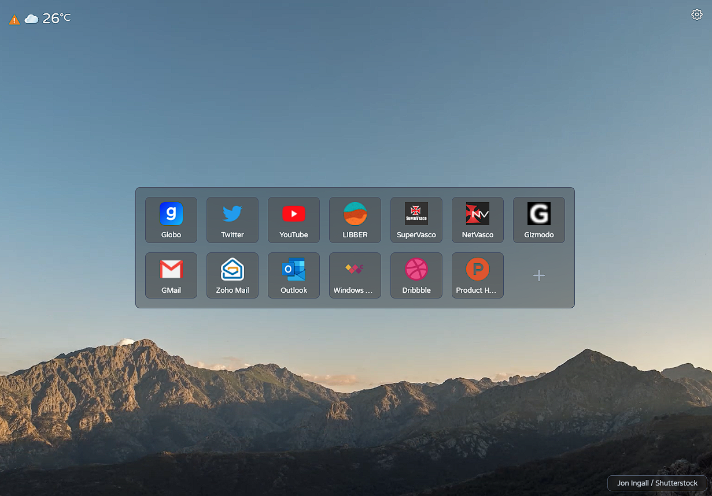
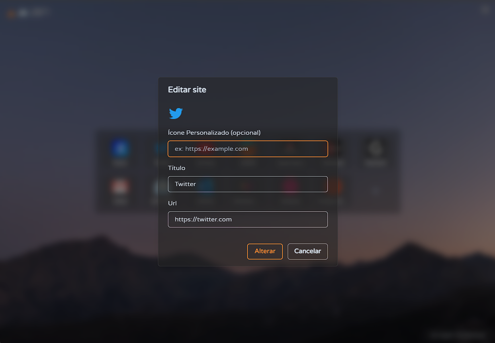
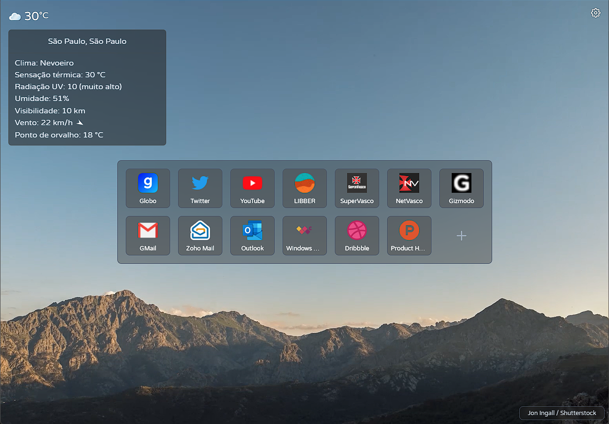

<!-- PROJECT LOGO -->
 

  <h3 style="font-size: 32px; font-weight: bold;" align="center">Luscum Dashboard</h3>

  

    Why Momentum if you can have Luscum?
  

<!-- ABOUT THE PROJECT -->

## About The Project

Luscum Dashboard is a minimalist Chromium extension based on Momentum Dashboard & default Microsoft Edge start page. It uses Microsoft APIs to provide video, weather & auto sugest data, and gStatic to provide better website icon.

Attention: The extension uses Microsoft public APPID & ApiKey, if they change it for some reason, you can update in the Settings (but I'll probably release an update to fix it).

### Features

- Background with video playback (from Microsoft API)
- Add, edit, remove & sort Top Sites
- Define the columns number for Top Sites
- Define a custom icon to a Top Site
- Define a location to get weather data

### Built With

- React JS
- Chakra-UI

<!-- GETTING STARTED -->

## Getting Started

To get a local copy up and running follow these simple steps.

### Prerequisites

- Chromium browser

### Instalation (Release)

1. Download the lastest version from Releases section.
2. Enable developer mode in extensions screen of the browser & load the folder as an unpacked extension.

### Instalation (Source code)

1. Clone the repository.
2. Execute: 'yarn install' and after 'yarn build'
3. The extension folder will be in build/extension-pack.
4. Enable developer mode in extensions screen of the browser & load the folder as an unpacked extension.

<!-- ROADMAP -->

## Roadmap

Since it's a hobby project, future features will take some time to show up.

### Planed features

- Add en-US localization
- Add an option to choose between video or image in the background
- Add an option to choose the videos from Microsoft API
